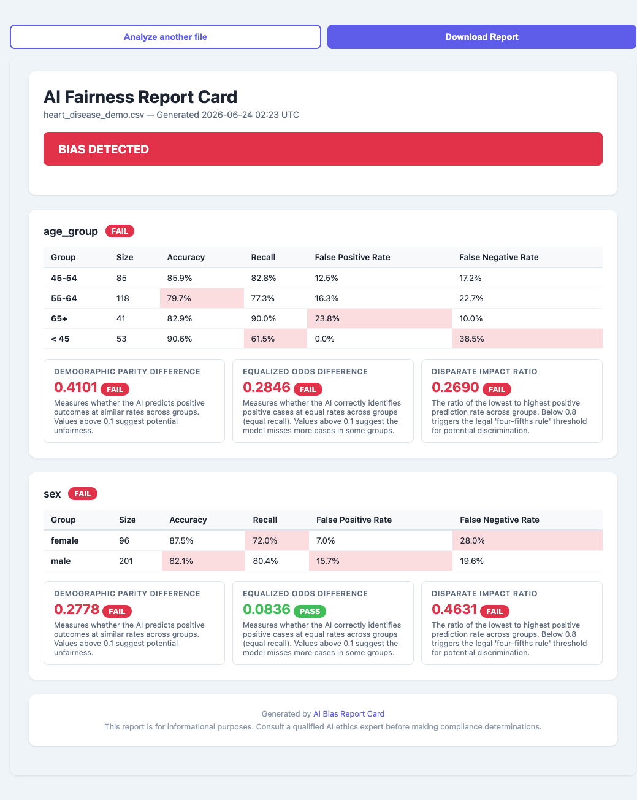

# AI Bias Report Card

A web tool that takes a CSV of AI model predictions and patient demographics, computes fairness metrics across protected groups, and generates a shareable one-page visual Report Card. It answers: **"Did your AI treat everyone equally?"**

Most teams deploying AI check overall accuracy and ship. They never measure performance by demographic subgroup. This tool makes that check simple, fast, and shareable — producing a color-coded report any executive can understand in 60 seconds.



---

## Prerequisites

- **Docker + Docker Compose** (recommended), _or_
- **Python 3.11+** with pip

---

## Quick Start

```bash
git clone https://github.com/Sumanth0601/AI-bias-reportcard
cd AI-bias-reportcard
docker compose up
```

Open [http://localhost:8000](http://localhost:8000) and upload `backend/demo/heart_disease_demo.csv` to see a live demo.

### Without Docker

```bash
cd backend
pip install -r requirements.txt
uvicorn main:app --reload --port 8000
```

---

## Column Mapping

When you upload a CSV, the tool asks you to identify three types of columns:

- **Ground Truth Column** — the actual outcome (what really happened). Must be binary: `0` or `1`.
- **Model Prediction Column** — what the AI predicted. Must be binary: `0` or `1`.
- **Demographic Columns** — one or more columns identifying group membership (e.g. `sex`, `age_group`, `race`). Can be strings or numbers.

---

## Metrics Explained

### Accuracy

The fraction of predictions the model got right for a group. A model can have high overall accuracy while performing poorly for a minority subgroup — this metric surfaces that.

### Recall (Sensitivity)

Of all the people who actually had the condition, what fraction did the model correctly identify? Low recall means the model is "missing" true cases in that group — a critical failure in healthcare.

### False Positive Rate

Of all the people who did NOT have the condition, what fraction did the model incorrectly flag? A high FPR leads to unnecessary interventions or costs for that group.

### False Negative Rate

Of all the people who DID have the condition, what fraction did the model miss? High FNR is the mirror of low recall and represents under-diagnosis.

### Demographic Parity Difference

Measures whether the AI predicts positive outcomes at similar rates across groups. Computed as `max(prediction_rate) − min(prediction_rate)`. Values above 0.1 suggest potential unfairness; above 0.2 is a FAIL.

### Equalized Odds Difference

Measures whether the AI correctly identifies positive cases at equal rates (equal recall) across groups. Computed as `max(recall) − min(recall)`. Values above 0.1 are flagged.

### Disparate Impact Ratio

The ratio of the lowest to highest positive prediction rate across groups (`min / max`). A value below 0.8 triggers the legal "four-fifths rule" threshold used in employment discrimination law.

---

## Demo Dataset

The demo uses the [UCI Heart Disease (Cleveland) dataset](https://archive.ics.uci.edu/dataset/45/heart+disease). A logistic regression is trained on clinical features (chest pain type, cholesterol, etc.) **without** access to demographic columns — so any observed disparity reflects real data patterns, not explicit demographic use.

To regenerate the demo CSV:

```bash
cd backend/demo
python generate_demo.py
```
